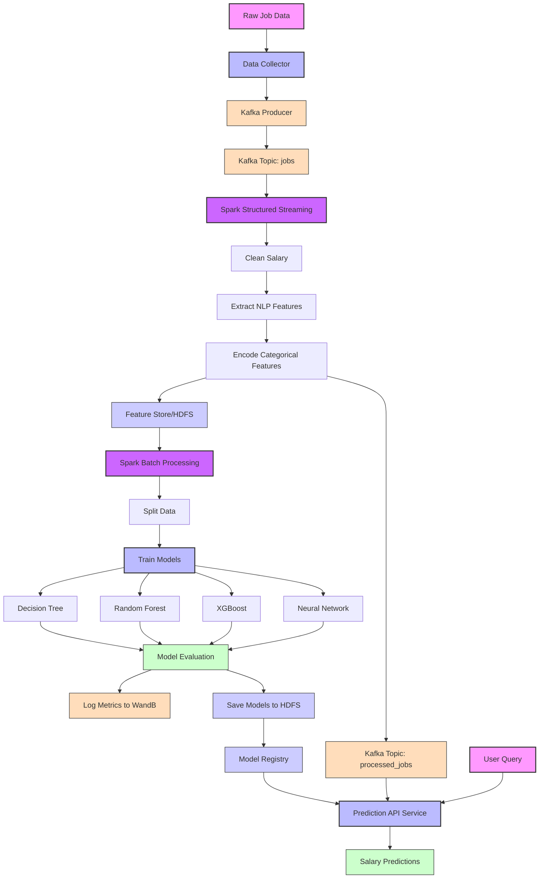

# Salary Prediction System for Vietnamese Job Market

This project provides a machine learning system to predict salaries based on job descriptions from the Vietnamese job market using Apache Kafka and Apache Spark for real-time and batch processing.

## System Architecture

The salary prediction system follows a modern MLOps architecture with streaming and batch capabilities:

### Data Collection and Streaming
- **Data Collection**: Raw job data is continuously collected from job posting sites
- **Kafka Producer**: New job data is published to a Kafka topic `jobs`

### Stream Processing
- **Spark Structured Streaming**: Continuously reads from Kafka topic `jobs`
- **Data Processing**: Cleans salary information, extracts NLP features from job requirements, and encodes categorical features
- **Output**: Processed features are written to both:
  - Feature Store (HDFS/Hive) for batch training
  - Kafka topic `processed_jobs` for real-time predictions

### Model Training (Offline Batch)
- **Spark Batch Processing**: Periodically runs to train models using data from the Feature Store
- **Model Training**: Trains multiple models:
  - Decision Tree
  - Random Forest 
  - XGBoost
  - Neural Network
- **Model Evaluation**: Evaluates models and logs metrics to Weights & Biases
- **Model Storage**: Saves trained models to HDFS and registers them in the Model Registry

### Serving
- **Prediction API Service**: Loads models from the Registry and serves predictions
- **Real-time Processing**: Can process both:
  - Direct user queries via REST API
  - Streaming predictions from `processed_jobs` Kafka topic

## Project Structure

```
prediction/
├── data_preprocessing.py       # Data preprocessing utilities
├── train.py                    # Model training script
├── test.py                     # Model testing script
├── predict_salary.py           # Command-line utility for predictions
├── requirements.txt            # Required Python packages
├── models/                     # Directory for saved models
└── results/                    # Directory for test results
```

## Installation

1. Install required packages:

```bash
pip install -r requirements.txt
```

2. Download NLTK resources (this is done automatically when running the scripts, but you can also do it manually):

```python
import nltk
nltk.download('punkt')
nltk.download('stopwords')
nltk.download('wordnet')
```

## Usage

### 1. Data Preprocessing

The data preprocessing is handled by `data_preprocessing.py`. If you want to run preprocessing separately:

```bash
python data_preprocessing.py
```

This script:
- Loads job data from CSV
- Cleans salary information
- Extracts features from job requirements using NLP techniques
- Encodes categorical features
- Splits data into training and testing sets
- Saves processed data for later use

### 2. Training Models

To train all models (Decision Tree, Random Forest, XGBoost, Neural Network):

```bash
python train.py
```

This script:
- Preprocesses the data
- Trains all four models
- Evaluates their performance
- Creates visualizations
- Saves models to the `models/` directory

### 3. Testing Models

To test the trained models:

```bash
python test.py
```

This script:
- Loads the trained models
- Evaluates them on the test set
- Visualizes the results
- Demonstrates prediction on sample data

### 4. Predicting Salaries

#### Using the Python Script

You can use the `predict_salary.py` script to make predictions:

```bash
python predict_salary.py --field "Kế toán / Kiểm toán" --experience "2 năm" --location "Hà Nội" --company_size "25-99 nhân viên" --requirements "Tốt nghiệp Đại học chuyên ngành Kế toán, Kiểm toán hoặc các ngành liên quan. Thành thạo phần mềm kế toán Misa, Word, Excel."
```

Arguments:
- `--field`: Job field/industry
- `--experience`: Experience requirement (e.g., "2 năm")
- `--location`: Job location
- `--company_size`: Company size (e.g., "25-99 nhân viên")
- `--requirements`: Job requirements
- `--model`: Model to use (options: decision_tree, random_forest, xgboost, neural_network, ensemble)
- `--models_dir`: Directory containing trained models

#### Using as a Module

You can also use the system as a module in your own Python code:

```python
from predict_salary import SalaryPredictor

predictor = SalaryPredictor(models_dir='./models')

predictions = predictor.predict(
    field="Kế toán / Kiểm toán",
    experience="2 năm",
    location="Hà Nội",
    company_size="25-99 nhân viên",
    requirements="Tốt nghiệp Đại học chuyên ngành Kế toán, Kiểm toán hoặc các ngành liên quan. Thành thạo phần mềm kế toán Misa, Word, Excel."
)

# Get ensemble prediction
ensemble_prediction = predictor.get_ensemble_prediction(predictions)
print(f"Predicted salary: {ensemble_prediction:.2f} million VND")
```

## Models

The system uses four different models:

1. **Decision Tree**: A simple model that makes decisions based on the features.
2. **Random Forest**: An ensemble of decision trees.
3. **XGBoost**: A gradient boosting algorithm known for its performance.
4. **Neural Network**: A deep learning model with multiple layers.

The default prediction is an ensemble of all four models.

## Features

The system extracts the following types of features:

1. **Categorical Features**: 
   - Field (industry)
   - Experience
   - Location
   - Company Size

2. **Text Features from Requirements**:
   - Processes job requirements using NLP
   - Extracts skills like Excel, Word, English proficiency, etc.
   - Handles both Vietnamese and English terms

## Performance

The models are evaluated using the following metrics:
- Mean Squared Error (MSE)
- Root Mean Squared Error (RMSE)
- Mean Absolute Error (MAE)
- R² Score

Visualizations of model performance are saved in the `results/` directory.

## Notes

- The system works best on job descriptions similar to those in the training data.
- When encountering categories not seen during training, the system uses default values, which may affect prediction accuracy.
- Salary predictions are given in millions of Vietnamese Dong (VND).
